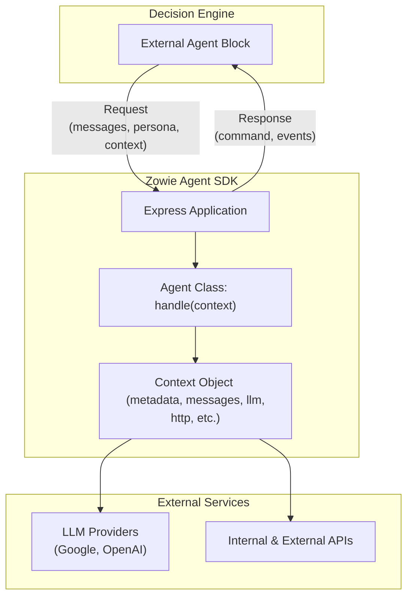

# Zowie Agent SDK for Node.js

A TypeScript/JavaScript framework for building external agents that integrate with [Zowie Decision Engine](https://docs.zowie.ai/docs/process-automation).
With this SDK, you can build agents that:

- Process conversations and generate natural responses
- Connect to internal systems and private APIs
- Use LLMs (Google Gemini, OpenAI GPT) for reasoning
- Transfer conversations between workflow blocks
- Get **full observability** in [Zowie Supervisor](https://docs.zowie.ai/docs/improve#supervisor--observe--understand) (LLM calls + API calls auto-tracked)

The SDK handles all communication with the Decision Engine so you can focus on your business logic.

## Table of Contents

- [Architecture](#architecture)
- [Prerequisites](#prerequisites)
- [Installation](#installation)
- [Quick Start](#quick-start)
- [Configuration](#configuration)
  - [LLM Provider Configuration](#llm-provider-configuration)
  - [Authentication Configuration](#authentication-configuration)
- [Usage Guide and API Reference](#usage-guide-and-api-reference)
  - [Agent Class](#agent-class)
  - [Context Class](#context-class)
  - [Response Types](#response-types)
  - [LLM Client](#llm-client)
  - [HTTP Client](#http-client)
  - [Value Storage](#value-storage)
- [Performance and Concurrency](#performance-and-concurrency)
- [Event Tracking and Observability](#event-tracking-and-observability)
- [API Endpoints](#api-endpoints)
- [Request Validation](#request-validation)
- [Testing](#testing)
- [Development Setup](#development-setup)
- [Support and Contributing](#support-and-contributing)

---

## Architecture

The SDK is built on **Express**, providing an HTTP server that integrates with Zowie's Decision Engine. Your agents receive conversation requests and fulfill them by connecting to LLMs for language understanding and external APIs to gather live data or execute tasks, then return responses.

### System Architecture Diagram



### Core Components

- **Agent Base Class**: Abstract base class defining the agent interface - implement your business logic here.
- **Context Management**: Request context with conversation history, metadata, and pre-configured clients.
- **LLM Integration**: Multi-provider support for Google Gemini and OpenAI GPT models with automatic event tracking.
- **HTTP Client**: Automatic request/response logging for private APIs and external services.
- **Authentication**: Multiple authentication methods for securing your agent endpoints.
- **Event Tracking**: All LLM calls and HTTP requests automatically logged and available in Supervisor.

---

## Prerequisites

- Node.js 20+
- An active Zowie AI Agent
- API keys for your chosen LLM provider (Google Gemini/OpenAI)

---

## Installation

### Using npm

```bash
npm install @zowieteam/zowie-agent-sdk
```

### Using pnpm (recommended)

```bash
pnpm add @zowieteam/zowie-agent-sdk
```

### Using yarn

```bash
yarn add @zowieteam/zowie-agent-sdk
```

### Dependencies

The SDK requires Node.js 20+ and includes the following core dependencies:

- **Express**: Web framework for building the HTTP API
- **Zod**: TypeScript-first schema validation
- **Google AI SDK**: For Google Gemini model integration
- **OpenAI SDK**: For OpenAI GPT model integration
- **Winston**: Logging library

---

## Quick Start

### 1\. Basic Agent Implementation

Create a simple agent that responds to user messages using an LLM.

```typescript
import {
  Agent,
  type AgentResponse,
  type Context,
} from "@zowieteam/zowie-agent-sdk";

class CustomerSupportAgent extends Agent {
  async handle(context: Context): Promise<AgentResponse> {
    // Process incoming requests and generate responses
    const response = await context.llm.generateContent(
      context.messages,
      "You are a helpful customer support assistant. " +
        "Provide accurate and friendly assistance."
    );

    return { type: "continue", message: response };
  }
}

// Configure the agent
const agent = new CustomerSupportAgent({
  llmConfig: {
    provider: "google",
    apiKey: process.env.GOOGLE_API_KEY || "",
    model: "gemini-2.5-flash",
  },
});

// Start the server
await agent.listen(3000);
```

### 2\. Running Your Agent

#### Development

Use the development script for a smooth development experience with auto-reload.

```bash
pnpx dev
# or
npm run dev
```

#### Production

For production deployment, build and start the agent.

```bash
pnpm build
node dist/example.js
# or use a process manager like PM2
pm2 start dist/example.js --name "zowie-agent"
```

### 3\. Advanced Example: Document Verification Expert

The repository includes a complete example (`example.ts`) demonstrating a **Document Verification Expert Agent** that showcases advanced SDK features:

- **Specialized Expertise**: Agent only handles document verification questions.
- **Scope Detection**: Uses structured analysis to determine if queries are within its domain.
- **Transfer Capability**: Automatically transfers out-of-scope questions to general support.
- **Internal System Integration**: Demonstrates connecting to internal APIs and private systems that cannot be exposed publicly.
- **Natural Responses**: Returns conversational answers to end users.

**Key Features Demonstrated:**

- `generateStructuredContent()` for intent analysis
- `TransferToBlockResponse` for seamless handoffs
- `context.http` for internal API calls with automatic logging and Supervisor visibility
- Expert system pattern for specialized business logic

**Example interactions:**

- "What documents do I need?" → Detailed requirements
- "Why was my passport rejected?" → Specific guidance
- "Reset my password" → Transfer to general support

Run the example: `pnpm dev`

---

## Configuration

### LLM Provider Configuration

Configure the LLM provider using one of the following configuration objects.

#### Google Gemini

```typescript
import type { GoogleProviderConfig } from "@zowieteam/zowie-agent-sdk";

const llmConfig: GoogleProviderConfig = {
  provider: "google",
  apiKey: process.env.GOOGLE_API_KEY || "",
  model: "gemini-2.5-flash", // or "gemini-2.5-pro"
  thinkingBudget: 0, // Optional: control thinking level
};
```

- **apiKey** (`string`): Your Google AI API key.
- **model** (`string`): The model name to use.
- **thinkingBudget** (`number`, optional): Controls the reasoning token budget for thinking-capable models (e.g., gemini-2.5-pro).
  - Positive values (e.g., `1024`, `2048`): Set a specific token budget for reasoning
  - `0`: Disable thinking/reasoning
  - `-1`: Enable dynamic thinking budget
  - Minimum budget for gemini-2.5-pro: `128` tokens

#### OpenAI GPT

```typescript
import type { OpenAIProviderConfig } from "@zowieteam/zowie-agent-sdk";

const llmConfig: OpenAIProviderConfig = {
  provider: "openai",
  apiKey: process.env.OPENAI_API_KEY || "",
  model: "gpt-5-mini", // or "gpt-5"
  reasoningEffort: "low", // Optional: tune reasoning level
};
```

- **apiKey** (`string`): Your OpenAI API key.
- **model** (`string`): The model name to use.
- **reasoningEffort** (`"low" | "medium" | "high"`, optional): Controls the reasoning effort for reasoning models (o1, o3, GPT-5 series).
  - `"low"`: ~20% of max_tokens allocated for reasoning (faster, less thorough)
  - `"medium"`: ~50% of max_tokens allocated for reasoning (balanced, default)
  - `"high"`: ~80% of max_tokens allocated for reasoning (slower, more thorough)

### Authentication Configuration

Secure your agent's endpoint using an authentication strategy that matches your Zowie External Agent Block configuration.

#### API Key Authentication

```typescript
import type { APIKeyAuth } from "@zowieteam/zowie-agent-sdk";

const authConfig: APIKeyAuth = {
  type: "api_key",
  headerName: "X-API-Key",
  apiKey: process.env.AGENT_API_KEY || "",
};
```

- **headerName** (`string`): Name of the HTTP header containing the API key.
- **apiKey** (`string`): The expected API key value.

#### Basic Authentication

```typescript
import type { BasicAuth } from "@zowieteam/zowie-agent-sdk";

const authConfig: BasicAuth = {
  type: "basic",
  username: process.env.AGENT_USERNAME || "admin",
  password: process.env.AGENT_PASSWORD || "",
};
```

- **username** (`string`): The expected username for HTTP Basic Auth.
- **password** (`string`): The expected password for HTTP Basic Auth.

#### Bearer Token Authentication

```typescript
import type { BearerTokenAuth } from "@zowieteam/zowie-agent-sdk";

const authConfig: BearerTokenAuth = {
  type: "bearer",
  token: process.env.AGENT_BEARER_TOKEN || "",
};
```

- **token** (`string`): The expected bearer token value.

### Agent Configuration Parameters

You can customize the agent's behavior during initialization.

```typescript
const agent = new MyAgent({
  llmConfig,
  httpTimeoutMs: 10000, // Default HTTP timeout
  authConfig, // Authentication (optional)
  includePersonaByDefault: true, // Include persona in LLM calls
  includeContextByDefault: true, // Include context in LLM calls
  includeHttpHeadersByDefault: true, // Include headers in event logs
  includeRequestBodiesInEventsByDefault: true, // Include HTTP request bodies in events
  logLevel: "info", // Logging level
});
```

---

## Usage Guide and API Reference

### Agent Class

The `Agent` class is the base for all agents. Inherit from this class and implement the `handle` method.

#### Agent Properties

- `logger: winston.Logger`: Logger instance for this agent, automatically configured with the agent's class name (e.g., `zowie_agent.MyAgent`).
- `app: Express`: The Express application instance exposed for advanced customization and deployment.

```typescript
import {
  Agent,
  type AgentResponse,
  type Context,
} from "@zowieteam/zowie-agent-sdk";

class MyAgent extends Agent {
  async handle(context: Context): Promise<AgentResponse> {
    /**
     * Process the incoming request and return a response.
     *
     * @param context - Request context containing messages, metadata, and clients
     * @returns Promise resolving to either continue or finish response
     */
    // Your agent logic goes here
    const response = await context.llm.generateContent(
      context.messages,
      "You are a helpful assistant"
    );

    this.logger.info(`Generated response: ${response}`);
    return { type: "continue", message: response };
  }
}
```

#### Logging Configuration

The agent automatically sets up logging with the specified log level (default: "info"). You can customize the log level during agent initialization:

```typescript
const agent = new MyAgent({
  llmConfig,
  logLevel: "debug", // Options: debug, info, warn, error
});
```

**Note**: The SDK automatically logs request start/end and errors. Use `this.logger` for business logic events, debugging, and monitoring specific to your agent's functionality.

For a complete example of effective logging usage, see the `DocumentVerificationExpertAgent` in `example.ts`, which demonstrates logging for query analysis, scope decisions, and error handling.

### Context Class

The `Context` object provides access to all request data and pre-configured clients.

- `metadata: Metadata`: Request metadata (IDs, timestamps).
- `messages: Message[]`: Conversation message history.
- `context?: string`: Context string from the Zowie configuration.
- `persona?: Persona`: Chatbot persona information.
- `llm: LLM`: LLM client with automatic context injection and event tracking.
- `http: HTTPClient`: HTTP client with automatic event tracking.
- `storeValue: (key: string, value: unknown) => void`: Function to store values in the Decision Engine.

The primary data objects within the `Context` have the following structure:

#### Metadata

Contains identifiers for the current request and conversation.

```typescript
interface Metadata {
  requestId: string;
  chatbotId: string;
  conversationId: string;
  interactionId?: string;
}
```

#### Message

Represents a single message in the conversation history.

```typescript
interface Message {
  author: "User" | "Chatbot";
  content: string;
  timestamp: Date;
}
```

#### Persona

Describes the AI's personality, context, and tone, as configured in Zowie.

```typescript
interface Persona {
  name?: string;
  businessContext?: string;
  toneOfVoice?: string;
}
```

### Response Types

Your `handle` method must return one of two response types.

#### Continue Conversation Response

Continue the conversation in the current process block.

```typescript
return {
  type: "continue",
  message: "Your response message here",
};
```

#### Transfer to Block Response

Transfer the conversation to another process block.

```typescript
return {
  type: "finish",
  nextBlock: "target-block-reference-key",
  message: "Optional message sent before transfer.",
};
```

### LLM Client

The `context.llm` client provides methods for interacting with language models.

#### Text Generation

```typescript
const responseText = await context.llm.generateContent(
  context.messages,
  "Custom system prompt",
  {
    includePersona: true, // Override agent default
    includeContext: true, // Override agent default
  }
);
```

#### Structured Content Generation

Generate structured JSON output that conforms to a Zod schema. This is ideal for tasks like intent detection, entity extraction, or data classification.

```typescript
// Example usage within your agent's handle() method
import { z } from "zod";

const OrderAnalysisSchema = z.object({
  urgency: z.number().min(1).max(5).describe("Urgency level from 1 to 5"),
  sentiment: z.enum(["positive", "neutral", "negative"])
});

type OrderAnalysis = z.infer<typeof OrderAnalysisSchema>;

async handle(context: Context): Promise<AgentResponse> {
  const analysis = await context.llm.generateStructuredContent(
    context.messages,
    OrderAnalysisSchema,
    "Analyze this customer service conversation about an order."
  );

  this.logger.info(`Order analysis - Urgency: ${analysis.urgency}, Sentiment: ${analysis.sentiment}`);

  // Use the analysis to determine response
  if (analysis.urgency >= 4) {
    return {
      type: "finish",
      nextBlock: "urgent-support",
      message: "This looks urgent. Let me connect you with a specialist."
    };
  } else {
    return {
      type: "continue",
      message: `I understand your ${analysis.sentiment} feedback about the order. How can I help?`
    };
  }
}
```

#### Basic Structured Output

For simple data extraction, you can use basic Zod schemas with just string fields:

```typescript
// Example usage within your agent's handle() method
import { z } from "zod";

const UserInfoSchema = z.object({
  name: z.string(),
  email: z.string(),
  message: z.string()
});

type UserInfo = z.infer<typeof UserInfoSchema>;

async handle(context: Context): Promise<AgentResponse> {
  const userInfo = await context.llm.generateStructuredContent(
    context.messages,
    UserInfoSchema,
    "Extract the user's name, email, and main message from the conversation."
  );

  this.logger.info(`Extracted user info - Name: ${userInfo.name}, Email: ${userInfo.email}`);

  return {
    type: "continue",
    message: `Hello ${userInfo.name}! I see you're reaching out about: ${userInfo.message}. ` +
             `I'll make sure to follow up with you at ${userInfo.email} if needed.`
  };
}
```

#### Advanced Structured Output

For complex business logic, you can use nested schemas with validation. Here's an example of a technical support diagnostic system that integrates with internal tools:

```typescript
// Example usage within your agent's handle() method
import { z } from "zod";

const TechnicalDiagnosticSchema = z.object({
  system: z.object({
    platform: z.enum(["windows", "macos", "linux", "ios", "android", "web"]),
    version: z.string().optional(),
    browser: z.string().optional()
  }),
  issue: z.object({
    category: z.enum(["authentication", "performance", "connectivity", "data_sync", "feature_request"]),
    severity: z.number().min(1).max(5).describe("Severity from 1=low to 5=critical"),
    reproducible: z.boolean(),
    errorCodes: z.array(z.string()).default([])
  }),
  userExpertise: z.enum(["beginner", "intermediate", "advanced", "developer"]),
  previousTickets: z.number().min(0).describe("Number of previous support tickets"),
  actions: z.object({
    immediateSteps: z.array(z.string()).describe("Steps user can try immediately"),
    requiresEscalation: z.boolean(),
    estimatedResolutionTime: z.number().min(0).max(72).describe("Hours to resolve"),
    internalToolsNeeded: z.array(z.string()).default([])
  }),
  confidenceScore: z.number().min(0.0).max(1.0)
});

type TechnicalDiagnostic = z.infer<typeof TechnicalDiagnosticSchema>;

async handle(context: Context): Promise<AgentResponse> {
  const diagnostic = await context.llm.generateStructuredContent(
    context.messages,
    TechnicalDiagnosticSchema,
    "Analyze this technical support conversation and provide structured diagnostic information for internal systems integration."
  );

  // Use the diagnostic data to integrate with internal systems
  if (diagnostic.actions.requiresEscalation) {
    this.logger.info(`Critical ${diagnostic.issue.category} issue - escalating to engineering`);
    return {
      type: "finish",
      nextBlock: "engineering-escalation",
      message: "This requires our engineering team's attention. I'm escalating this now."
    };
  } else {
    this.logger.info(`${diagnostic.issue.category} issue can be resolved in ${diagnostic.actions.estimatedResolutionTime}h`);
    return {
      type: "continue",
      message: `I can help resolve this ${diagnostic.issue.category} issue. ` +
               `Based on my analysis, this should take about ${diagnostic.actions.estimatedResolutionTime} hours to fix.`
    };
  }
}
```

**Provider-Specific Schema Handling**:

- **OpenAI**: Uses native Zod schema support via `zodResponseFormat()`. Requires optional fields to use `.nullable()` instead of `.optional()`.
- **Google Gemini**: Zod schemas are automatically converted to JSON Schema using `zod-to-json-schema`. Supports both `.optional()` and `.nullable()`.

For cross-provider compatibility, use `.nullable()` for optional fields. Refer to the [Google Gemini](https://ai.google.dev/gemini-api/docs/structured-output) and [OpenAI](https://platform.openai.com/docs/guides/structured-outputs) documentation for provider-specific details.

### HTTP Client

The `context.http` client provides standard HTTP methods (`get`, `post`, `put`, etc.) with automatic event tracking for observability in Supervisor.

```typescript
// GET request to a document verification system
const response = await context.http.get(
  "https://internal-docs.company.com/verify/passport/ABC123",
  { Authorization: `Bearer ${process.env.DOC_SYSTEM_TOKEN || ""}` },
  {
    timeout: 5000,
    includeHeaders: false, // Don't include headers in events for this sensitive request
  }
);

// POST request to a fraud detection service
const fraudCheck = await context.http.post(
  "https://fraud-detection.internal/analyze",
  { user_id: "12345", transaction_id: "txn_abc" },
  { "X-API-Key": process.env.FRAUD_API_KEY || "" },
  {
    includeRequestBodies: false, // Don't include request body in events for this call
  }
);

if (fraudCheck.ok) {
  const data = await fraudCheck.json();
  console.log(`Fraud check result: ${JSON.stringify(data)}`);
}
```

### Value Storage

Store key-value pairs within the conversation that can be used later in the Decision Engine.

```typescript
async handle(context: Context): Promise<AgentResponse> {
  // Store a value for use in the current conversation
  context.storeValue("user_preference", "email_notifications");

  return { type: "continue", message: "Your preferences have been saved!" };
}
```

---

## Performance and Concurrency

### Asynchronous by Design

The SDK uses **asynchronous handlers** with TypeScript's native `async`/`await` patterns. This provides excellent performance for I/O-heavy operations like LLM calls and HTTP requests, which are common in agent workflows.

```typescript
async handle(context: Context): Promise<AgentResponse> {
  // Efficient async code with proper error handling
  const data = await context.http.get(url, headers);
  const response = await context.llm.generateContent(context.messages);
  return { type: "continue", message: response };
}
```

### Scaling

Node.js handles concurrency efficiently through its event loop. For production deployments:

- **Single Process**: Can handle hundreds of concurrent requests efficiently
- **Horizontal Scaling**: Use PM2 or container orchestration for multiple instances
- **Load Balancing**: Place behind a load balancer for high-availability setups

```bash
# Production with PM2 cluster mode
pm2 start dist/example.js --name "zowie-agent" -i max

# Or with Docker containers
docker run -p 3000:3000 your-agent-image
```

---

## Event Tracking and Observability

The SDK automatically tracks all `context.http` and `context.llm` calls as events. These are sent back with every agent response and are visible in **Supervisor**, giving you complete observability into your agent's interactions with external systems.

### API Call Event Example

```json
{
  "type": "api_call",
  "payload": {
    "url": "https://fraud-detection.internal/analyze",
    "requestMethod": "POST",
    "requestHeaders": { "X-API-Key": "***" },
    "requestBody": "{\"user_id\": \"12345\"}",
    "responseStatusCode": 200,
    "responseBody": "{\"risk_score\": 0.15}",
    "durationInMillis": 245
  }
}
```

### LLM Call Event Example

```json
{
  "type": "llm_call",
  "payload": {
    "model": "gemini-2.5-flash",
    "prompt": "{\n  \"messages\": [\n    {\n      \"author\": \"User\",\n      \"content\": \"What documents do I need for verification?\",\n      \"timestamp\": \"2024-01-15T10:30:00.000Z\"\n    }\n  ],\n  \"system_instruction\": \"You are a document verification expert.\"\n}",
    "response": "For account verification, you'll need to provide a government-issued ID and proof of residence.",
    "durationInMillis": 1200
  }
}
```

---

## API Endpoints

Your agent server exposes the following HTTP endpoints.

### `POST /`

This is the main endpoint for processing conversation requests from the Zowie Decision Engine.

---

#### Request Body

The incoming request from Zowie will have the following JSON structure.

```json
{
  "metadata": {
    "requestId": "unique-request-id",
    "chatbotId": "chatbot-identifier",
    "conversationId": "conversation-identifier",
    "interactionId": "optional-interaction-id"
  },
  "messages": [
    {
      "author": "User",
      "content": "What documents do I need to submit?",
      "timestamp": "2024-01-15T10:30:00.000Z"
    }
  ],
  "context": "Optional context string from the Zowie automation.",
  "persona": {
    "name": "Document Expert",
    "businessContext": "This agent specializes in document verification.",
    "toneOfVoice": "Professional and helpful."
  }
}
```

---

#### Response Bodies

Your agent must return one of the two following JSON structures, corresponding to the response type you choose.

##### For `ContinueConversationResponse`

This response sends a message back to the user and continues the conversation in the current block.

```json
{
  "command": {
    "type": "send_message",
    "payload": {
      "message": "For verification, you'll need a government-issued ID and proof of residence. Would you like specific details about acceptable document types?"
    }
  },
  "valuesToSave": {
    "interaction_type": "document_inquiry",
    "timestamp": "2025-09-17T01:34:40Z"
  },
  "events": [
    {
      "type": "llm_call",
      "payload": {
        "model": "gemini-1.5-flash",
        "prompt": "...",
        "response": "For verification, you'll need...",
        "durationInMillis": 1200
      }
    }
  ]
}
```

##### For `TransferToBlockResponse`

This response transfers the conversation to a different block in your Zowie automation flow. You can optionally send a final message before the transfer occurs.

```json
{
  "command": {
    "type": "transfer_to_block",
    "payload": {
      "message": "One moment, I'll get someone from our support team to help with that.",
      "nextBlock": "human-handoff-block-key"
    }
  },
  "valuesToSave": {
    "transfer_reason": "out_of_scope_question"
  },
  "events": [
    {
      "type": "llm_call",
      "payload": {
        "model": "gemini-1.5-flash",
        "prompt": "...",
        "response": "...",
        "durationInMillis": 950
      }
    }
  ]
}
```

---

### `GET /health`

A simple health check endpoint for monitoring.

- **Response Body**: `{"status": "healthy", "agent": "YourAgentClassName"}`

---

## Request Validation

All incoming requests to the `POST /` endpoint are automatically validated using Zod schemas. Invalid requests will receive an HTTP 400 Bad Request response with validation details.

The validation is forward-compatible, meaning new fields added by Zowie in the future will be ignored and won't break your agent.

---

## Testing

The SDK is designed to be easily testable. The repository includes a comprehensive test suite with mocks for external services.

### Running Tests

```bash
# Run all tests with mocks (recommended for CI/CD)
pnpm test

# Run tests with coverage report
pnpm run test:coverage

# Run tests in watch mode during development
pnpm run test:watch

# Run real E2E tests against live APIs (requires API keys)
GOOGLE_API_KEY="..." OPENAI_API_KEY="..." pnpm run test:real
```

### Writing Tests

Use Jest with mocking to test your agent's logic without making real network calls. The SDK provides TypeScript support for easy testing.

```typescript
import { jest } from "@jest/globals";
import { Agent, type Context } from "@zowieteam/zowie-agent-sdk";

// Mocking an HTTP request
const mockHttpGet = jest.fn();
jest.mock("@zowieteam/zowie-agent-sdk", () => ({
  ...jest.requireActual("@zowieteam/zowie-agent-sdk"),
  HTTPClient: jest.fn().mockImplementation(() => ({
    get: mockHttpGet,
  })),
}));

describe("MyAgent", () => {
  it("should handle HTTP calls", async () => {
    mockHttpGet.mockResolvedValue({
      ok: true,
      json: () => Promise.resolve({ data: "test" }),
    });

    // Your agent testing logic here...
  });

  it("should handle LLM calls", async () => {
    const mockLLM = {
      generateContent: jest.fn().mockResolvedValue("Test response from LLM"),
    };

    // Your agent testing logic here...
  });
});
```

---

## Development Setup

For contributors working on the SDK itself:

```bash
# Clone the repository
git clone https://github.com/zowie-ai/zowie-agent-sdk-node/
cd zowie-agent-sdk-node

# Install dependencies
pnpm install

# Development commands

# Individual tools
pnpm build        # Build TypeScript to JavaScript
pnpm test         # Run tests (real API tests skipped if no keys)
pnpm run lint     # Check code style
pnpm run lint:fix # Fix linting issues
pnpm run format   # Format code
pnpm run typecheck # Run TypeScript type checking

# Combined commands
pnpm run check    # Run ALL checks (lint, typecheck, tests)

# Development workflow
pnpm dev          # Start development server with watch mode
pnpm run build:watch # Build in watch mode
pnpm run test:watch  # Run tests in watch mode

# Utility
pnpm run clean    # Remove build artifacts
pnpm run install:clean # Clean reinstall of dependencies
```

---

## Support and Contributing

For issues, questions, or contributions, please refer to the project repository.
